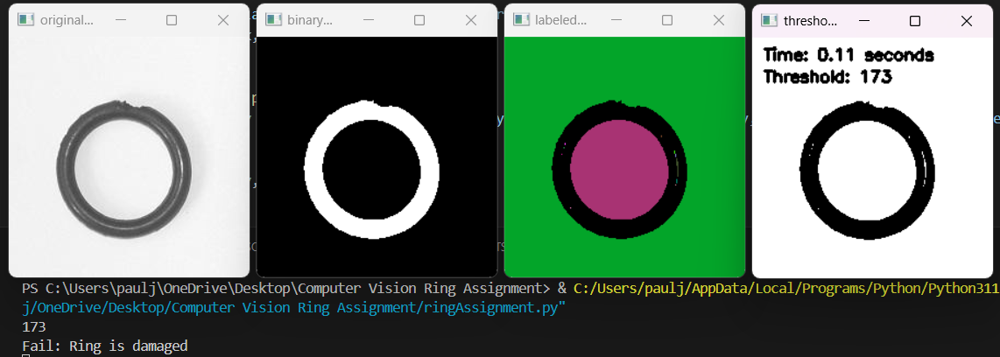

# O-ring Inspection

## Overview

The goal was to develop a program to inspect images of O-rings for defects. O-rings, those rubber gaskets used for sealing joints, can have flaws during manufacturing, and the goal of this program was to detect these flaws using custom image processing techniques.

## My Approach

- **Image Segmentation**: I began by analyzing the image histogram to automatically choose a threshold for segmentation. Then, I performed thresholding to obtain a binary image. In some cases, I also applied binary morphology techniques to clean up the binary image.
  
- **Connected Component Labeling**: Implementing connected component labeling was a crucial step. This helped me accurately extract the O-ring region, usually the largest foreground region in the image.
  
- **Defect Analysis**: Once I had the regions identified, I analyzed them to determine if the O-ring had any flaws. Some flaws were easier to detect than others.

## Overcoming Challenges

One of the main challenges was the restriction on using OpenCV for image analysis. However, this limitation pushed me to write my own image processing routines, which deepened my understanding of the concepts.

## Achievements

- **Thresholding and Morphology**: I successfully found the threshold using the image histogram and performed thresholding. Additionally, I applied binary morphology to close any interior holes in the binary image.
  
- **Connected Component Labeling**: Implementing connected component labeling was a significant milestone. It allowed me to accurately extract the O-ring region, which was crucial for defect analysis.
  
- **Defect Analysis**: Analyzing the regions to classify O-rings as pass or fail based on flaws was the most rewarding part.
